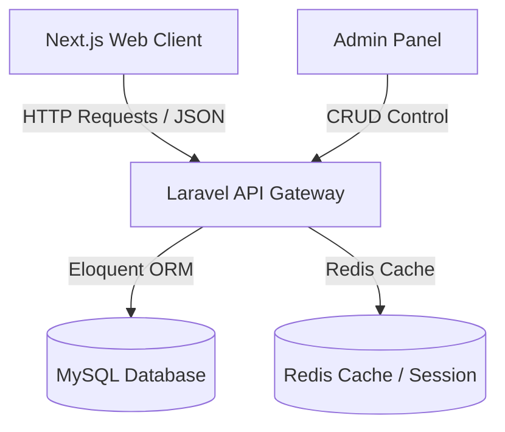

# Lozybyte headless stack

This repository contains the source code for the **Lozybyte Solutions** website and headless management platform. The application is built using a modern decoupled architecture consisting of a high-performance **Next.js** frontend and a robust **Laravel** REST API backend.

---

## 🏗️ Architecture Overview



*   **Frontend**: Next.js (App Router, React, Tailwind CSS, Framer Motion)
*   **Backend**: Laravel (REST API, Sanctum, Rate Limiting, Live Editor Sync)
*   **Database**: MySQL / PostgreSQL
*   **Cache**: Redis (Session storage & query cache)

---

## 📂 Project Structure

```
lozybyte/
├── app/                  # Laravel core application source code
├── config/               # Laravel configuration files
├── database/             # Laravel database migrations and seeders
├── frontend/             # Next.js web client source code
│   ├── src/
│   │   ├── app/          # Next.js App Router pages
│   │   └── components/   # UI & interactive components
│   └── package.json
├── routes/               # Laravel routing declarations (api.php, web.php)
├── bootstrap/            # Laravel application bootstrap loader
└── README.md             # Project documentation
```

---

## 🚀 Getting Started

### 📋 Prerequisites
Make sure you have the following installed on your machine:
*   PHP >= 8.2 & Composer
*   Node.js >= 18 & npm
*   MySQL or PostgreSQL Server

---

### 1. Setting Up the Backend (Laravel)

1. Navigate to the project root and install Composer dependencies:
   ```bash
   composer install
   ```

2. Copy the example environment file and configure database/app keys:
   ```bash
   copy .env.example .env
   php artisan key:generate
   ```

3. Configure your database details inside `.env`:
   ```env
   DB_CONNECTION=mysql
   DB_HOST=127.0.0.1
   DB_PORT=3306
   DB_DATABASE=lozybyte_db
   DB_USERNAME=root
   DB_PASSWORD=your_password
   ```

4. Run the migrations and database seeders to populate initial settings:
   ```bash
   php artisan migrate --seed
   ```

5. Launch the local Laravel development server:
   ```bash
   php artisan serve
   ```
   The backend will be available at [http://127.0.0.1:8000](http://127.0.0.1:8000).

---

### 2. Setting Up the Frontend (Next.js)

1. Navigate to the `frontend/` directory and install npm dependencies:
   ```bash
   cd frontend
   npm install
   ```

2. Create a `.env.local` file inside `frontend/` and point it to your backend API server:
   ```env
   NEXT_PUBLIC_API_URL=http://localhost:8000/api
   SITE_URL=http://localhost:3000
   ```

3. Run the development server:
   ```bash
   npm run dev
   ```
   The frontend web client will be running at [http://localhost:3000](http://localhost:3000).

---

## 🔒 Security Config

*   **CORS Configuration**: Restrict allowed origins to production domains inside `config/cors.php`.
*   **Rate Limiting**: Configured under `app/Providers/RouteServiceProvider.php` to protect API endpoints against DDoS and brute force.
*   **Honeypot & CAPTCHA**: Contact form fields are secured using custom honeypot checks and verification tokens.

## ⚡ Build for Production

### Backend Optimization
```bash
composer install --optimize-autoloader --no-dev
php artisan config:cache
php artisan route:cache
php artisan view:cache
```

### Frontend Production Build
```bash
cd frontend
npm run build
npm run start
```
